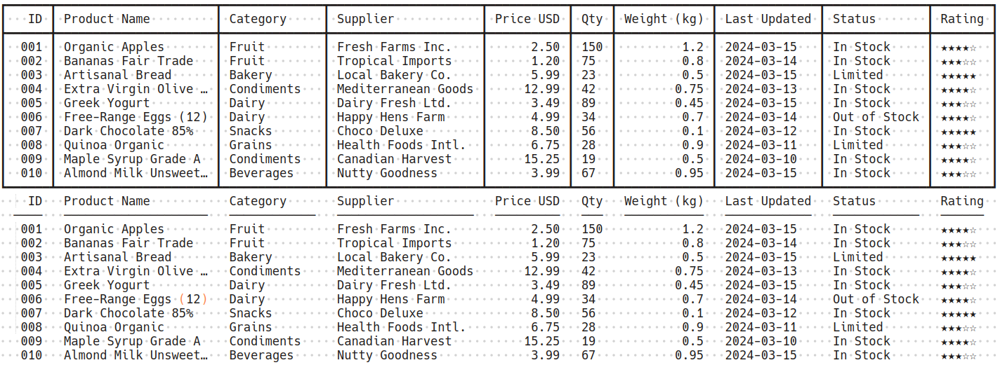
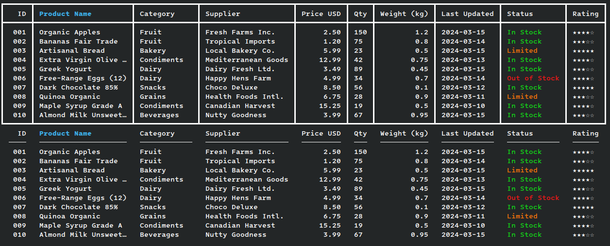

# tabulator

Nim library for generating plain-text tables (with Unicode and ANSI code support)

## Features

- **Auto‑column creation** – Define columns explicitly or let the library infer them from your data
- **Unicode‑aware** – Correct display width for CJK, fullwidth forms, emoji, skin‑tone modifiers, combining marks, and zero‑width joiners
- **ANSI code support** – Colors and styling preserved in terminal output; stripped cleanly for file output[^*]
- **Configurable columns** – Fixed or auto‑width, left/center/right alignment
- **Terminal‑aware output** – Natural width by default; shrinks only if the table would exceed the terminal
- **Clean output** – Optional box‑drawing borders, no trailing whitespace in file output[^#]
- **Hyperlinks** – Passes through OSC 8 hyperlink sequences for terminals that support them
- **No external dependencies** – Uses only Nim standard library

  <br />

  

## Installation

```bash
nimble install tabulator
```

Or, copy `tabulator.nim` into your project.

## Quick Start

```nim
import tabulator

var t = newTable()

t.addColumn("Product", width = 20)
t.addColumn("Price", align = Right)
t.addColumn("In Stock", align = Center)

t.addRow(@["Apple", "$2.50", "\e[32myes\e[0m"])
t.addRow(@["Banana", "$1.20", "no"])
t.addRow(@["Cherry", "$15.00", "\e[31mlow\e[0m"])

t.renderTable(separator = true)
```

Output (colors not visible here):
```
┏━━━━━━━━━━━━━━━━━━━━━━┳━━━━━━━━┳━━━━━━━━━━┓
┃ Product              ┃  Price ┃ In Stock ┃
┣━━━━━━━━━━━━━━━━━━━━━━╋━━━━━━━━╋━━━━━━━━━━┫
┃ Apple                ┃  $2.50 ┃   yes    ┃
┃ Banana               ┃  $1.20 ┃    no    ┃
┃ Cherry               ┃ $15.00 ┃   low    ┃
┗━━━━━━━━━━━━━━━━━━━━━━┻━━━━━━━━┻━━━━━━━━━━┛
```

## API Reference

### Types
```nim
type Alignment* = enum
  Left    ## Text is left-padded (default)
  Center  ## Text is centred within the column width
  Right   ## Text is right-padded

type Table* = ref object  # Opaque, create with newTable()
```

### Consts
```nim
const Version* = "1.0.0"
  ## For checking the current version programmatically
```

### Procedures
```nim
proc newTable(): Table
  ## Create a new empty table

proc addColumn(t: Table, title: string = "", width: int = 0, align: Alignment = Left)
  ## Add a column definition
  ## - `title`: Column header (pre‑format with embedded ANSI codes)
  ##   - if ALL column titles are empty = no header
  ## - `width`: Fixed width in display cells (0 = auto‑size to content)
  ##   - `1` produces "…" when content is longer; `2` produces "x…"; etc.
  ## - `align`: Cell alignment (Left, Center, Right)

proc addRow(t: Table, cells: seq[string])
  ## Add a row of data; cells are strings (pre‑format numbers, embed ANSI codes)

proc renderTable(t: Table, separator = false, width: int = 0, outFile: File = stdout)
  ## Render the table
  ## - `separator`: If true, adds box‑drawing borders between columns
  ## - `width`: Table width target
  ##   - `0` (default) → natural width. On a terminal, shrinks if natural
  ##     exceeds terminal width; never stretches.
  ##   - `> 0` → table is exactly that width (auto columns grow or shrink).
  ##     Fixed columns never resize.
  ## - `outFile`: Output file (default stdout)
```

### Internal helpers (exported for tests, not part of the stable API)
```nim
proc visibleLen(s: string): int
  ## Display width of s, ignoring ANSI escapes

proc stripAnsi(s: string): string
  ## Remove all ANSI escape sequences from s
```

## Examples

### Auto‑columns (no header)
Automatically creates columns based on data:
```nim
var t = newTable()
t.addRow(@["A", "Short text", "42"])
t.addRow(@["B", "Longer piece of content here", "-15"])
t.addRow(@["", "Another row", "9999"])
t.renderTable()
```

### Styled headers and cells
```nim
var t = newTable()
t.addColumn("\e[1;4mImportant\e[0m", width = 15)
t.addColumn("\e[33mValue\e[0m", align = Right)
t.addRow(@["Normal text", "\e[32m✓\e[0m"])
t.renderTable(separator = true)
```

## Advanced Usage

### Position‑based terminal rendering vs whole-line rendering for text-file output
When outputting to a terminal, `tabulator` uses cursor positioning for accurate display of all Unicode scripts (including East‑Asian and complex scripts like Hindi, Arabic)
```nim
# Terminal gets cursor‑based output
t.renderTable()
```

Provide a file handle for text-file output:
```nim
# Files get clean text output (ANSI stripped)
let f = open("table.txt", fmWrite)
t.renderTable(outFile = f)
close(f)
```

### Width handling

- **Terminal output:**
  - `width = 0` → natural width; shrinks only if the table would exceed the terminal
  - `width > 0` → laid out for exactly that width, then clipped at the terminal
  - Never stretched to fill the terminal
- **File output:**
  - `width = 0` → natural width
  - `width > 0` → exactly that width; the file contains the whole table, no clipping
- **Fixed columns** (set via `addColumn(width = N)`) are never resized. If
  fixed columns alone exceed the target, the table overflows.

```nim
# Expands auto‑width columns to exactly 120 display cells
t.renderTable(width = 120)

# Natural width, shrunk to fit if the terminal is narrower
t.renderTable()

# File with no width limit
let f = open("wide.txt", fmWrite)
t.renderTable(outFile = f)  # No truncation
close(f)
```

### Cell truncation
Fixed‑width columns truncate with ellipsis:
```nim
t.addColumn("Description", width = 10)
t.addRow(@["This is too long and will show as 'This is t…'"])
```

Wide characters are never split mid‑glyph:
```nim
t.addColumn("Name", width = 4)
t.addRow(@["中文字符"])  # Shows "中…" — never half a glyph
```

### Without borders
Pass `separator = false` (the default) to omit box‑drawing borders between columns.

### No cell-overflow/text wrapping
If necessary, handle this yourself by splitting the text and adding extra rows

[](https://github.com/erykjj/nim-tabulator/releases.atom)

[^*]: On Windows 10/11, ANSI escape sequences must be enabled in the console (see [here](https://ss64.com/nt/syntax-ansi.html))
[^#]: For proper display of box‑drawing characters (┏, ┃, ┗, etc.), ensure your terminal/console font supports the Unicode box-drawing block characters (U+2500‑U+257F)
